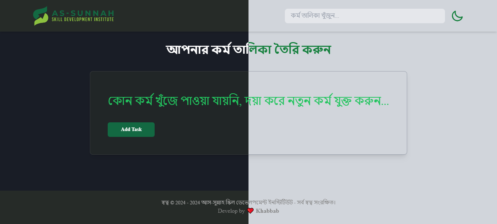

# 📖কর্ম তালিকার ডকুমেন্ট:

## ✨ ফিচারস্:

এই কর্ম তালিকা অ্যাপ ব্যাবহার করে আপনি আপনার দৈনন্দিনের কর্মের তালিকা করতে পারবেন। যে কাজ সম্পন্ন হয়ে যাবে সেই কাজ মার্ক করে রাখতে পাবেন। একটা একটা করে তালিকা ডিলিট করতে পারবেন। তালিকা সংযোগ করার সময় ভুল হলে সটা সংশোধন করতে পারবেন।

- আপনার পছন্দ মতো ডার্ক এবং ওয়াইট থিম ব্যবহার করেত পারবোন।
- দৈনন্দিনের কর্ম তালিকা সংযোগ করতে পারবেন।
- কর্ম তালিকা চেক আনচেক করতে পারবেন।
- একটা একটা করে কর্ম তালিকা ডিলিট এবং এডিট করতে পারবেন।
- সবগুলা কর্ম তালিকা একসাথে ডিলিট করতে পারবেন।
- যে কোন কর্ম তালিকা খুজে নিতে পারবেন।
- সম্পূর্ণ রেসপন্সিভ।
- লোকাল স্টোরেজ।

---

## ‍💻কম্পিউটারে যা যা সার্পট করবে:

1. Mark/Unmark
2. Title
3. Description
4. Tags
5. Priority
6. Options

---

## 📟 ট্যাবলেটে যা যা সার্পট করবে:

1. Mark/Unmark
2. Title
3. Tags
4. Priority
5. Options

---

## 📱 মোবাইলে যা যা সার্পট করবে:

1. Mark/Unmark
2. Title
3. Tags
4. Options

---

## 👨🏻‍💻 টেকনোলজি:

- </> HTML5 (Simentic HTML)
- </> CSS3 (Tailwind css)
- </> javaScript (Recj.js)
- </> Recj.js
- </> React icons

---
